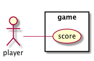
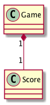

Étude Op. 10, No. 10
===================

# 目的 #
Railsアプリケーションの構築・配置

# 前提 #
| ソフトウェア   | バージョン   | 備考        |
|:---------------|:-------------|:------------|
| ruby           |2.4.0     |             |
| node           |7.4.0     |             |
| rails          |5.1.0.rc1 |             |
| vagrant        |1.8.7     |             |
| docker         |17.03.1   |             |
| docker-compose |1.11.2    |             |

# 構成 #
1. [構築](#構築)
1. [配置](#配置)
1. [開発](#開発)

## 構築
### 仮想マシンを使った開発
```bash
vagrant up
vagrant ssh
cd /vagrant
```

### Dockerコンテナを使った開発
```bash
docker build . -t app:base
docker run --name app --rm -p 5000:5000 -p 9292:9292 -v $(PWD):/container -i -t app:base /bin/bash
cd /container
```

上記の作業ディレクトリで以下の作業を実施する

### Railsのインストール
```bash
vagrant up
vagrant ssh
cd /vagrant
gem install rails -v 5.1.0.rc1
```

### Railsアプリケーションのセットアップ
```bash
rails new .
rails s -b 0.0.0.0 -p 3000
```
`http://0.0.0.0:3000`に接続して動作を確認する

### アプリケーションコンポーネントのセットアップ
LiveReloadセットアップ
```bash
bundle exec guard init
```

#### テスト環境セットアップ
```bash
bundle install
rails generate rspec:install
bundle binstubs rspec-core
./bin/rspec
```

#### ドキュメント環境セットアップ
```bash
bundle exec rails g annotate:install
bundle exec yard
bundle exec yard server
```

`http://0.0.0.0:8808`に接続して動作を確認する

#### JavaScript環境セットアップ
Webpackerのセットアップ

```bash
bin/rails webpacker:install
```

Reactのセットアップ

```bash
bin/rails webpacker:install:react
```

webpack-dev-serverを有効にする
```bash
bundle install
bin/webpack
bundle exec foreman start -f Procfile.dev
```
または
```bash
./bin/server
```

React-Bootstrapのセットアップ
```bash
./bin/yarn add react-bootstrap
```

#### JavaScriptテスト環境のセットアップ
```bash
npm install -g quik
npm install -g mocha
npm install --save-dev chai sinon enzyme jsdom mocha quik react-addons-test-utils babel-cli
```

Mochaの動作のテスト
```bash
npm test
npm run test:watch
```

**[⬆ back to top](#構成)**

## 配置
### Herokuセットアップ
```bash
rbenv local 2.4.0
heroku create op10-no10
```

アプリケーションの初回デプロイ
```bash
# ビルドパックの追加
$ heroku buildpacks:add --index 1 heroku/nodejs
$ heroku buildpacks:add --index 2 heroku/ruby

# デプロイとマイグレーション実行
$ git push heroku master
$ heroku run rake db:migrate

# Heroku上のアプリケーションを開く
$ heroku open
```

### Jenkinsセットアップ(仮想マシン利用時)
```
sudo cat /var/lib/jenkins/secrets/initialAdminPassword
```
`http://0.0.0.0:9000`に接続してJenkinsをセットアップする

Crumb Dataが必要な場合は`http://0.0.0.0:9000/crumbIssuer/api/json`からcrumbを取得する

**[⬆ back to top](#構成)**

## 開発
### 仕様
ユースケース



スコアカード


概念モデル



**[⬆ back to top](#構成)**

# 参照 #
+ [ReactでTDD（テスト駆動開発）を始めよう : 環境構築からテスト作成、機能実装までの詳解ガイド](http://postd.cc/getting-started-with-tdd-in-react/)