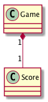

Étude Op. 10, No. 10
===================

[](https://circleci.com/gh/k2works/etude_op10_no10)

# 目的 #
Railsアプリケーションの構築・配置

# 前提 #
| ソフトウェア   | バージョン   | 備考        |
|:---------------|:-------------|:------------|
| ruby           |2.4.0    |             |
| node           |7.4.0    |             |
| rails          |5.1.0    |             |
| vagrant        |1.8.7    |             |
| docker         |1.12.5   |             |
| docker-compose |1.8.0    |             |

# 構成 #
1. [構築](#構築)
1. [配置](#配置)
1. [開発](#開発)

## 構築
### Railsのインストール
```bash
vagrant up
vagrant ssh
cd /vagrant
gem install rails -v 5.1.0.beta1
```

### Railsアプリケーションのセットアップ
```bash
rails new .
```

```bash
rails s -b 0.0.0.0
```
`http://192.168.30.1:3000`に接続して動作を確認する

### テスト環境セットアップ
```bash
bundle install
rails generate rspec:install
bundle binstubs rspec-core
./bin/rspec
```

### ドキュメント環境セットアップ
```bash
bundle exec yard
bundle exec yard server
```

```bash
bundle exec rails g annotate:install
```

### その他環境セットアップ

Rack_dev_markのセットアップ
```bash
bundle exec rails g rack:dev-mark:install
```

Webpackerのセットアップ
```bash
bin/rails webpacker:install
```

Reactのセットアップ
```bash
bin/rails webpacker:install:react
```

ジェネレータで生成するファイルの設定

webpack-dev-serverを有効にする
```bash
chmod 777 bin/server
```
ChromeDriverのセットアップ(Mac)
```bash
brew install chromedriver
```

PhantomJSのセットアップ(Mac)
```bash
brew install phantomjs
```

### VSCodeでデバッグを実行する
```bash
bundle exec rdebug-ide --host 0.0.0.0 --port 1234 --dispatcher-port 26162 -- bin/rails s -b 0.0.0.0
```
**[⬆ back to top](#構成)**

## 配置
### Herokuセットアップ
```bash
rbenv local 2.4.0
heroku create etude-op10-no10
git push heroku master
```

アプリケーションの初回デプロイ
```bash
# ビルドパックの追加
$ heroku buildpacks:add --index 1 heroku/nodejs
$ heroku buildpacks:add --index 2 heroku/ruby

# デプロイとマイグレーション実行
$ git push heroku master
$ heroku run rake db:migrate

# Heroku上のアプリケーションを開く
$ heroku open
```

### Jenkinsセットアップ
```
sudo su jenkins
cd ~/
git clone https://github.com/rbenv/rbenv.git ~/.rbenv
echo 'export PATH="$HOME/.rbenv/bin:$PATH"' >> ~/.bash_profile
source ~/.bash_profile
git clone https://github.com/rbenv/ruby-build.git ~/.rbenv/plugins/ruby-build
rbenv install 2.4.0
rbenv local 2.4.0
/usr/local/heroku/bin/heroku
sudo cat /var/lib/jenkins/secrets/initialAdminPassword
```
`http://192.168.30.1:8080`に接続してJenkinsをセットアップする

**[⬆ back to top](#構成)**

## 開発
### 仕様


### 設計


### 実装
hello world from webpacker
```bash
bin/webpack
```

hello_react.jsxを表示する画面を作成する
```bash
rails g controller Home index
```
JSのコンパイル
```bash
bin/webpack
```
hello_react.jsの動作確認
```bash
rails s
```

システムテストを書く
```bash
./bin/webpack
./bin/rails test
```
**[⬆ back to top](#構成)**

# 参照 #
+ [Visual Studio Codeを使ってRailsをデバッグ実行してみよう](http://qiita.com/chimame/items/56e48ab3145312ff1786)
+ [【動画付き】Rails 5.1で作るVue.jsアプリケーション ～Herokuデプロイからシステムテストまで～](http://qiita.com/jnchito/items/30ab14ebf29b945559f6)
+ [Rails 5.1でreact環境を作ってみた](http://qiita.com/kikunantoka/items/54f1859496003b1b1aff)
+ [Rails 5.1のSystemTestCaseを試してみた](http://qiita.com/jnchito/items/4d01f2faa1deee36bd27)