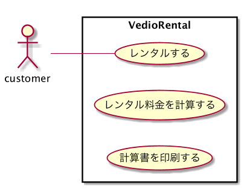
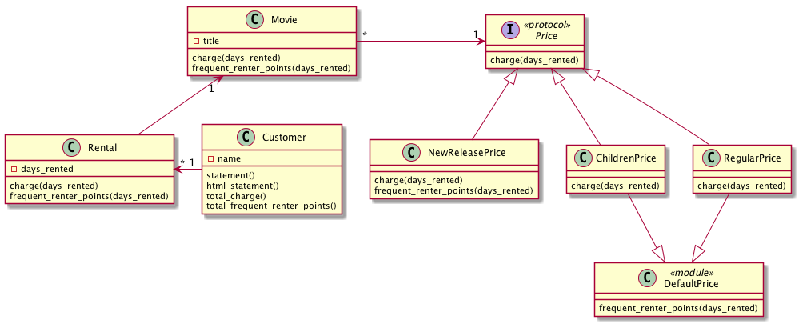

ビデオレンタル
---

## 基本仕様
+ ビデオレンタルの料金を計算して計算書を印刷するプログラム
+ システムにはどの映画を何日間借りるかが入力される。
+ 貸出の日数によって料金が計算され、映画の分類が判定される。
+ 映画の分類は３つある。一般向け、子供向け、新作。
+ レンタルポイントも印刷される。新作かどうかによってポイント計算の仕方が異なる。

## ユースケース

### ユースケース１：レンタルする

### ユースケース２：レンタル料金を計算する

### ユースケース３：計算書を印刷する

## コアモデル
